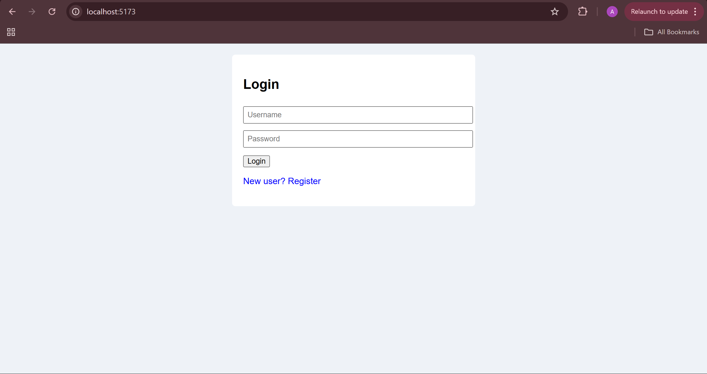
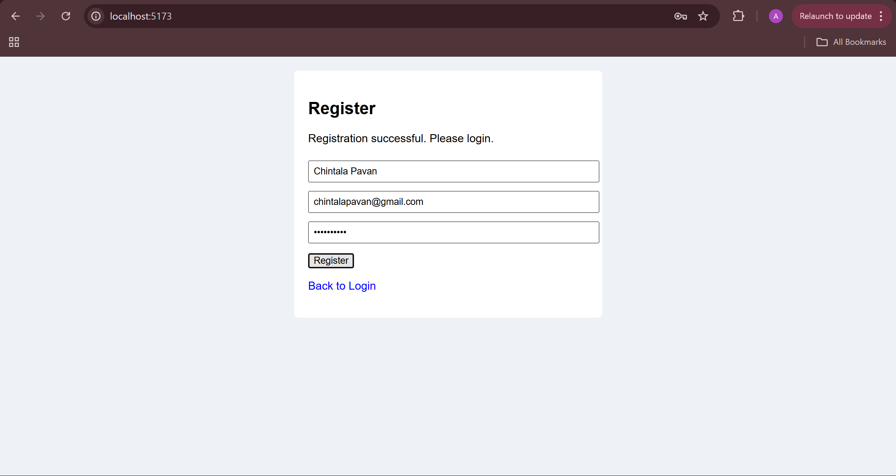
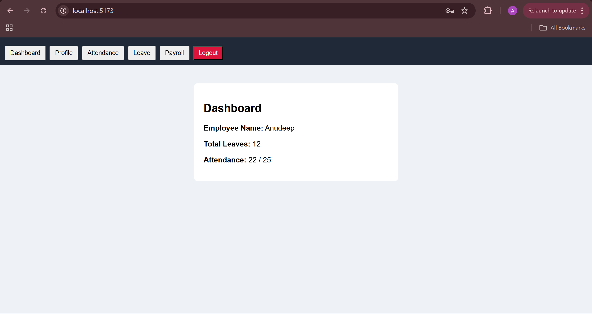
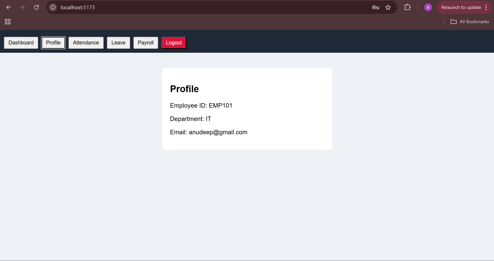
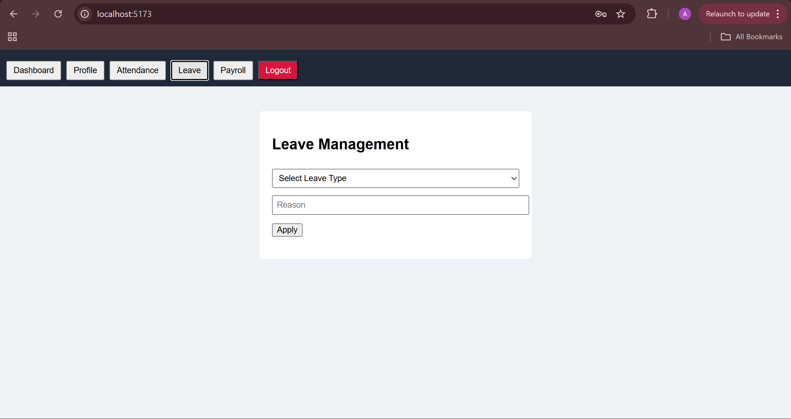
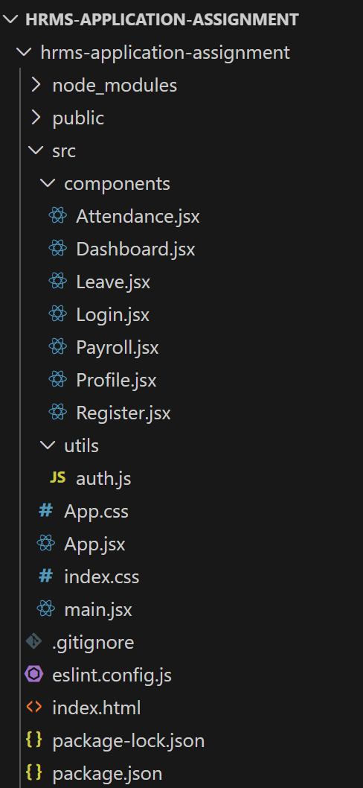

# Human-Resource-Management-System-Assignment

## Project Overview
This project is a basic **Human Resource Management System (HRMS) frontend application** developed as part of an assignment to demonstrate understanding of **HTML, CSS, JavaScript, and React**. The application provides essential HR-related functionalities with simple navigation and a clean UI.

---

## Objective
To build a simple HRMS frontend that showcases component-based architecture, state management, and basic validation using React, without backend integration.

---

## screenshots

---

## 📸 Screenshots

### Login Page


### Registration Page


### Dashboard


### Employee Profile


### Leave Management


### Project Structure



## Technologies Used
- HTML5  
- CSS3  
- JavaScript (ES6)  
- React (Vite setup)  
- Local Storage (JSON format for temporary data storage)

---

## Project Structure
```
hrms-react-app/
│
├── index.html
├── package.json
└── src/
├── App.jsx
├── main.jsx
├── App.css
│
├── utils/
│ └── auth.js
│
└── components/
├── Login.jsx
├── Register.jsx
├── Dashboard.jsx
├── Profile.jsx
├── Attendance.jsx
├── Leave.jsx
└── Payroll.jsx
```

---

## Features Implemented
- User Registration & Login (JSON-based using localStorage)
- Dashboard with employee summary
- Employee Profile view
- Attendance marking 
- Leave application and history tracking
- Payroll details 
- Logout functionality

---

## How to Run the Project
1. Open the project folder in **VS Code**
2. Open terminal and navigate to the project directory:
   ```bash
   cd Human-Resource-Management-System-Assignment
   ```
3. Install Dependencies:
   ```bash
   npm install
   ```
4. Start the development server:
   ```bash
   npm run dev
   ```
